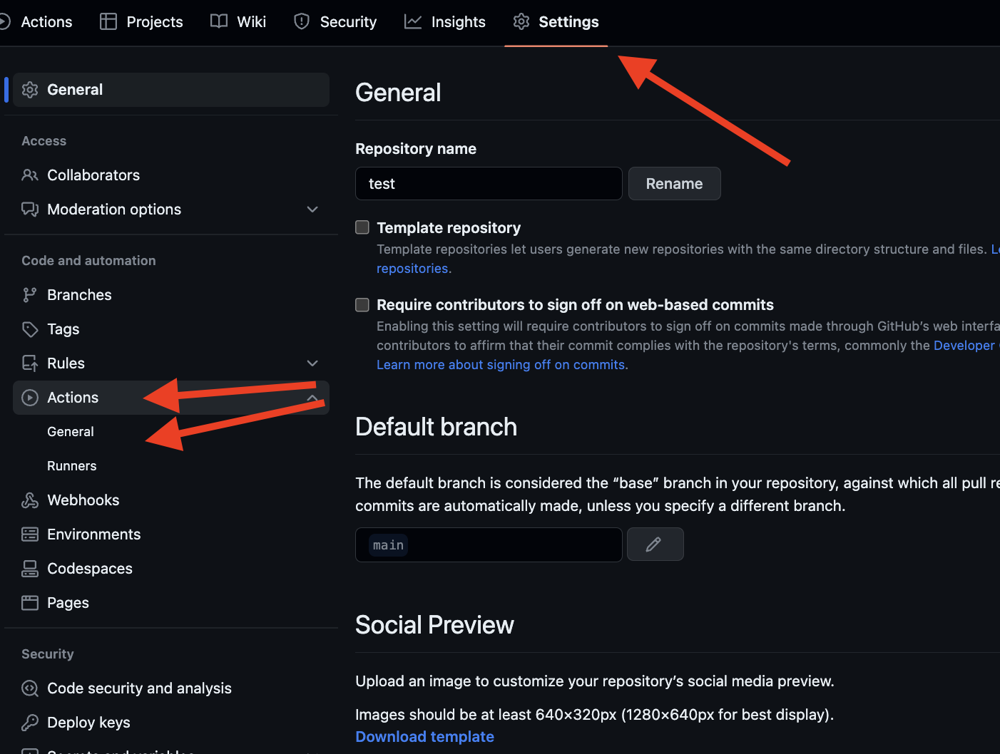
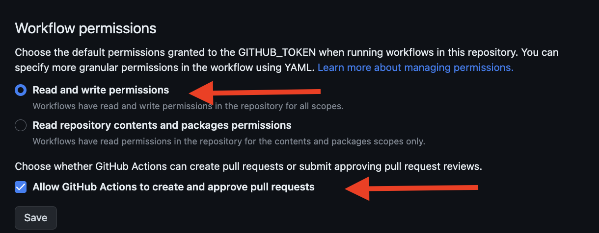
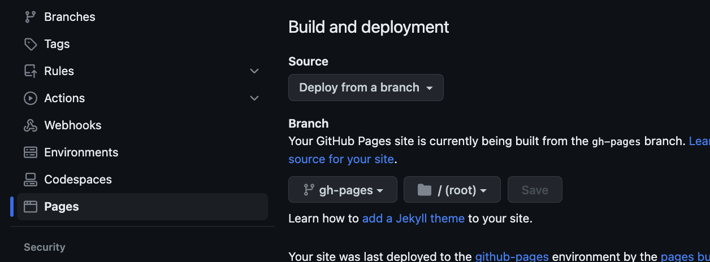
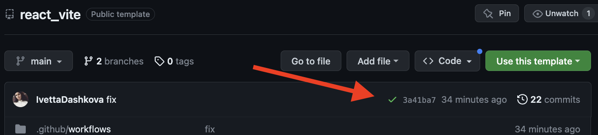
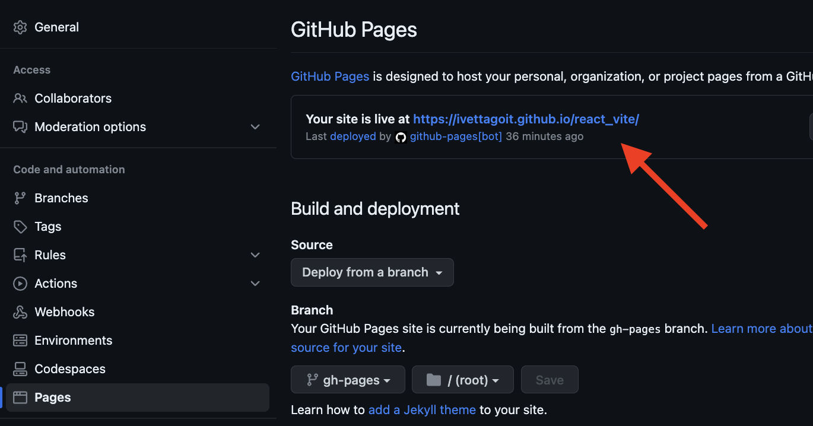
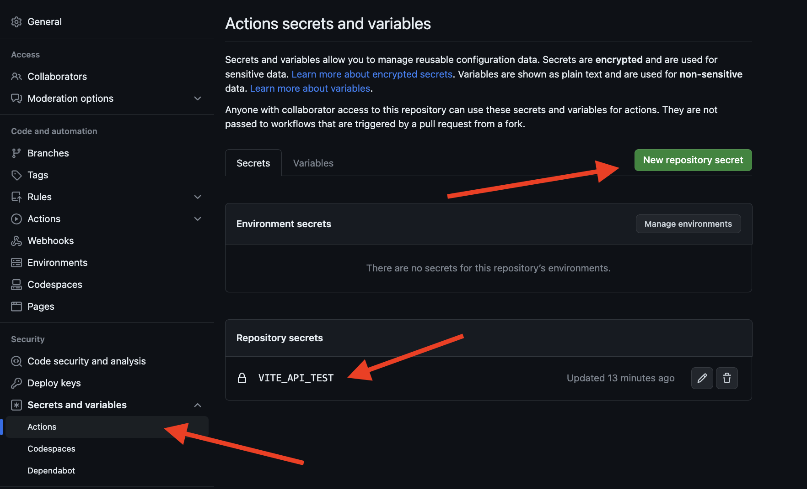

# React + Vite template

This project was created using [Create Vite](https://vitejs.dev/). For
familiarization and setting of additional features
[refer to documentation](https://vitejs.dev/guide/).

## Creating a repository according to a template

Use this GoIT organization repository as a template to build
repository of your project. To do this, click on the ``Use this template'' button and
select the ``Create a new repository'' option as shown in the image.


In the next step, the page for creating a new repository will open. fill in
its name field, make sure that the repository is public, and then click the button
`"Create repository from template"`.


After the repository is created, you need to go to the settings
created repository to `Settings` > `Actions` > `General` tab as shown
in the image.



After scrolling the page to the very end, in the ``Workflow permissions'' section, select
option `"Read and write permissions"` and check the checkbox. It is necessary
to automate the project deployment process.



Now you have a personal project repository with a file and folder structure
template repository. Then work with it as with any other personal one
repository, clone it to your computer, write code, commit and send
them on GitHub.

## Preparation for work

1. Make sure that the LTS version of Node.js is installed on your computer.
    [Download and install](https://nodejs.org/en/) it if necessary.
2. Install the basic dependencies of the project with the `npm install` command.
3. Start development mode by running `npm run dev` command.
4. Go to the address specified in the terminal in the browser.

## Deployment

The production version of the project will be automatically assembled and deployed on GitHub Pages,
to the `gh-pages` branch, whenever the `main` branch is updated. For example, after
direct push or accepted pull request. For this it is necessary in the file
`vite.config.js` edit the `base` field, replacing `react_vite` with its name
repository `"/your_repo_name"` and push the changes to GitHub.

Next, you need to go to the settings of the GitHub repository (`Settings` > `Pages`) and
expose distribution of the production version of files from the `/root' folder of the `gh-pages' branch, if
it was not done automatically.



### Deployment status

The deployment status of the extreme commit is displayed by an icon next to its identifier.

- **Yellow color** - project assembly and deployment is in progress.
- **Green color** - deployment completed successfully.
- **Red color** - an error occurred during assembly or deployment.

You can see more detailed information about the status by clicking on the icon, and in
in the drop-down window, go to the ``Details'' link.



### Live page

After some time, usually a few minutes, the live page can be viewed
the address specified in the GitHub repository settings (`Settings` > `Pages`).



If an empty page opens, make sure that there is no ``Console'' tab
errors related to incorrect paths to the CSS and JS files of the project
(**404**). Most likely, you have the wrong value of the `base` field
in the file `vite.config.js`.

### Routing

If the application uses the `react-router-dom' library for routing,
it is necessary to additionally configure the `<BrowserRouter>` component by passing in prope
`basename` the exact name of your repository. A slash at the beginning of a line is mandatory.

```jsx
<BrowserRouter basename="/your_repo_name">
   <App />
</BrowserRouter>
```
### Adding variables to .env
Use `.env` file to store configuration data such as API keys, server addresses, ports and other variables. To do this, it is necessary to remove the extra ".template" from the name of the `.env.template` file, after which the file will meet the conditions of the `.ignore` file and will be stored only locally, without being published to a remote repository for security purposes. To use variables on GitHub-pages, all variables provided by the .env file should be added to the `.github/workflows/deploy.yml` file as well as to the repository settings. To do this, go to (`Settings` > `Secrets and variables` > `Actions`)



## How it works

1. After each push to the `main` branch of the GitHub repository, it starts
    a special script (GitHub Action) from the `.github/workflows/deploy.yml` file.
2. All repository files are copied to the server where the project is initialized and
    passes assembly before deployment. 3 If all steps were successful, collected
    the production version of the project files is sent to the `gh-pages' branch. In another
    in this case, the script execution logs will indicate what the problem is.